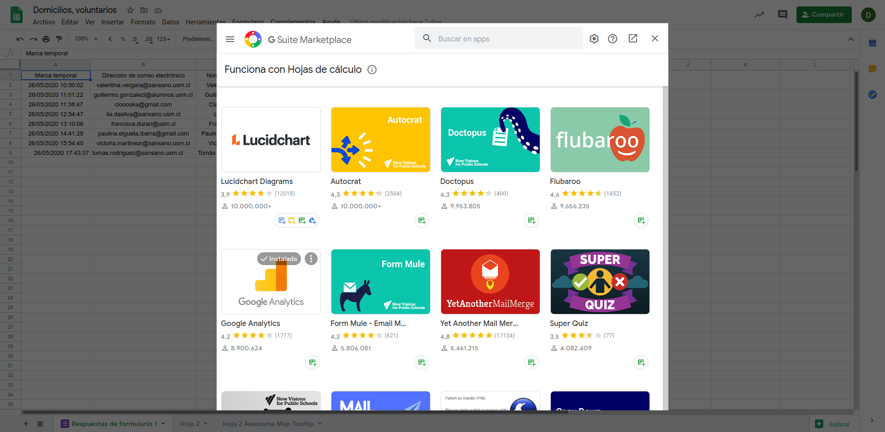
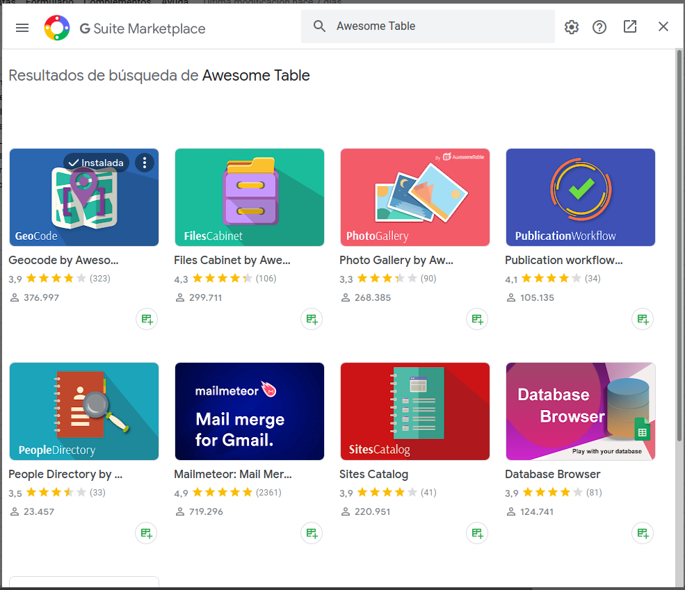
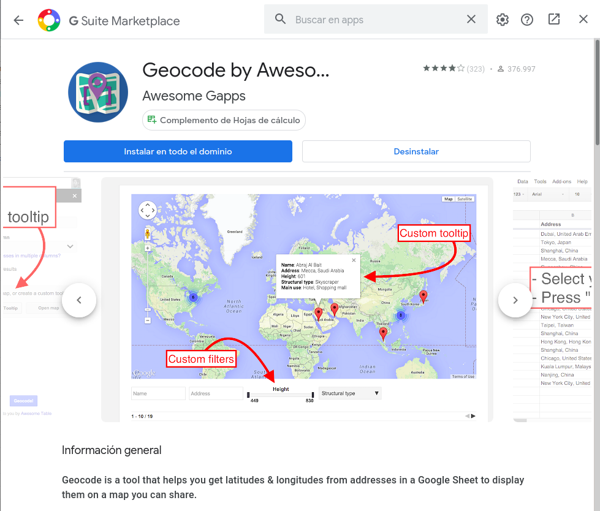
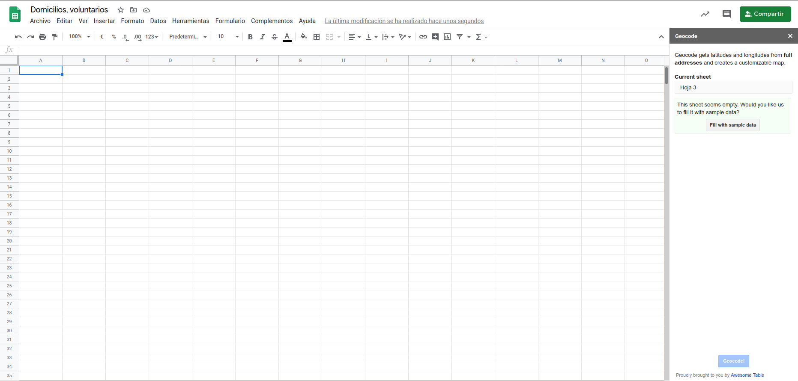
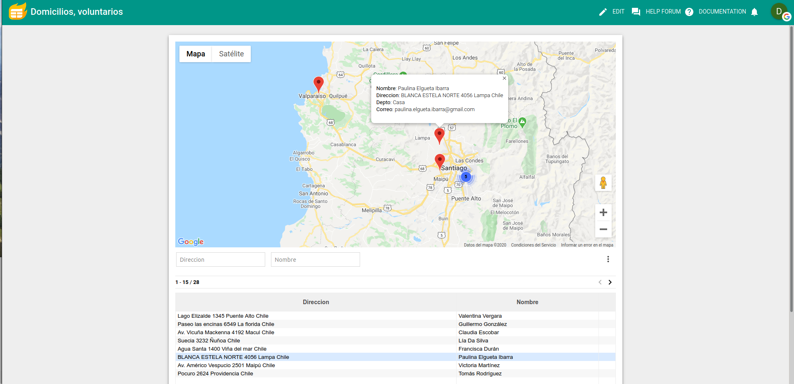

# Volunteers-Location
Aplicación que muestra la ubicación de los voluntarios utilizando add-on de google drive

Dado el estado de pandemía en el que nos encontramos, se deicidio realizar un programa/aplicación para optimizar la entrega de recursos y suministros a los voluntarios, utlizando la ruta más conveniente y que pueda abarcar a más personas.Para esto se utilizó un script (Add-on) de Google Drive llamado: Awesome Table. 

## ¿Que es Awesome Table?
 [Awesome Table](https://awesome-table.com/) es una aplicación que esta perfectamente integrado con Google y Office 365, la cual permite mostrar de manera dinamica y estilizada tablas e información. El único requisito para utilizar la app es tener una cuenta Google (gmail,gsuite) o Microsoft.
 
## ¿Cómo utilizar Awesome Table?
Para utilizar la aplicación en Google Drive, primero se instalar el add-on que se encuentra en el marketplace, el cual se encuentra en Complementos > Descargar Complementos. 

Dentro del marketplace, se debe buscar Awesome Table e instalar la opcion Geocode by Awesome Table

 

 Al momento de instalar el Add-on, se le dará la opción de instalar el plugin solo en el documento o de manera global, dependiendo de la necesidad será la opción que se elija.
 
 

Una vez instalado el plugin, para poder utilizarlo se se dirigen a Complementos> Geocode by Awesome Table > Start geocoding, la cual les abrirá una panel lateral, con los campos de Hoja actual y Address Column, los cuales serán los campos para generar dos nuevas columnas de latitud y longitud. El campo Address Column puede ser especifico o generado:
 * Especificado: La dirección deseada ya se encuentra disponible en una sola columna, es decir, la direccón completa en una celda ( ejemplo "Vicuña Mackenna 3939 San Joaquin Chile ").
 * Generada: Presioando en "Are your addresses in multiple columns?" le permitirá poner los campos de la dirección que desea en el orden en que se van agregando.
 
 El formato de la dirección, suele ser <Street + Number >< City >< Country >, mientras más especifica sea la dirección más exacta será la busqueda.

Cuando se tengan todos los campos listos, se presiona el boton "Geocode!" para generar la tabla. Suele ocurrir que al momento de generar las columnas de latitud y longitud  las coordenadas no vengan en decimales, es decir, en vez de -30,0456 aparece -300456. Cuando ocurre este error una opción es agregar manualmente la separación decimal o agregar una fórmula que divida el campo por la cantidad de decimales deseados.

Una vez todo listo se hace click en Create Map si es que es primera vez que se crea el mapa en el documento u open map

Antes de ir a la página de Awesome Table para ver el resultado, para obtener una mejor vista de los resultado se puede modificar la fila que esta debajo de la cabecera y agregar parametros para que Awesome Table interprete. Los [keywords o parametros](https://support.awesome-table.com/hc/en-us/articles/360002647539-Maps-app-Create-highly-customizable-interactive-maps) básicos que se utilizan para los mapas son:
* StringFilter : permite filtrar la tabla.
* NoFilter: No permite la busqueda o filtrado de la columna
* Hidden: Oculta la columna en Awesome Table.
* Latitude: Utilizando en la columna de latitud.
* Longitude: Utilizado en la columna de longitud.
* MapsLat: Similar a Latitude.
* MapsLong: Similar a Longitude.

Si se desea mostrar información al momento de hacer click en el marcador, se puede utilizar:
* MapsTooltip: Permitemostrar la información al hacer click en el marcador.
* Tooltip: Permite crear un cuadro con información al hacer click, este keyword utiliza HTML para crear la etiqueta o se puede crear mediante el boton "Custimize Tooltip" el cual agrega el campo junto con un nombre esto generará una hoja de cálculo oculta, la cual tendra en la celda A1 el campo que utilizará la etiqueta y en B1 la etiqueta escrita como HTML.

Al cargar la aplicación de Awesome Table mostrará el mapa con la tabla de datos debajo de él, si se crearon las etiquetas y no se pueden visualizar entonces se va a edit > Advanced Parameters y en Select a Template Sheet se busca la hoja que tiene la etiqueta creada y se colocan las celdas.

Una vez que se encuentre todo listo, se presiona Publish el cual le entregará distintas opciones para publicar, la primera es con una url para acceder directamente ( si el archivo tiene permisos entonces las personas que accedan a este deberan solicitarlo", el segundo es para poder colocarlo en documento HTML con iframe y el tercero es utilizando Javascript y HTML para poder mostrarlo en una pagina web o en HTML si se desea. 

